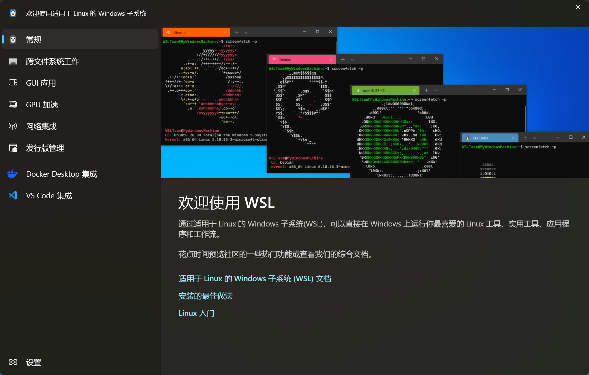
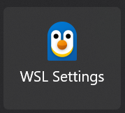
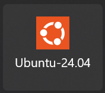
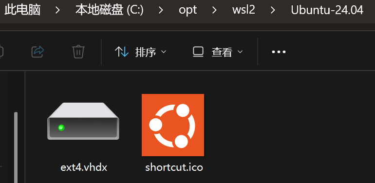
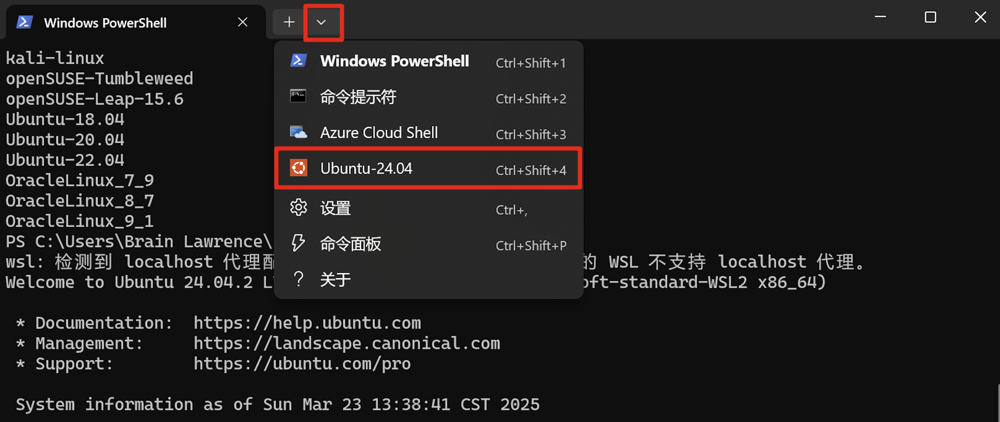
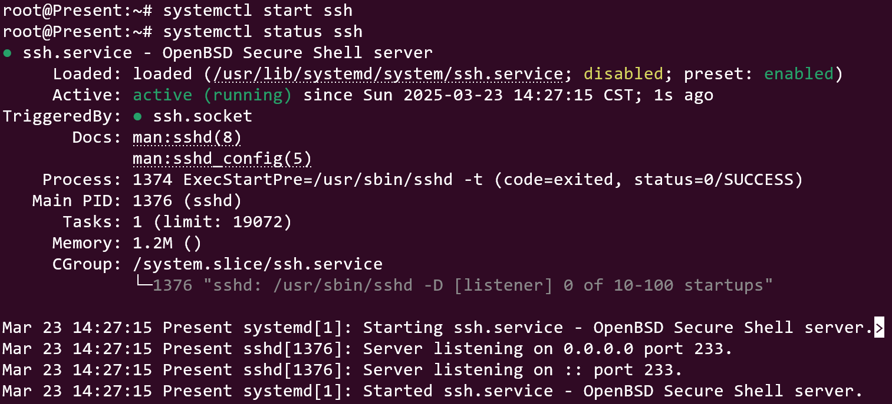
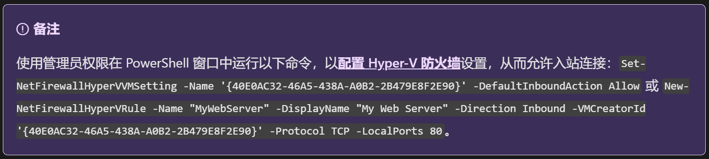

# 😎 WSL2安装Ubuntu

::: tip
本文是介绍如何使用任意一台Windows主机借助WSL2<u>创建Ubuntu虚拟系统</u>并<u>开放局域网内SSH连接</u>的操作指南！
:::

## 先决条件

1. 拥有能够访问github.com的网络环境；
2. 必须运行 Windows 10 版本 2004 及更高版本（内部版本 19041 及更高版本）或 Windows 11版本；


## 安装WSL2

以管理员身份运行PowerShell输入：

```shell
wsl --install
```

会打印如下内容：

::: info
正在下载: 适用于 Linux 的 Windows 子系统 2.4.12<br>
[============82.4%=====           ]
:::

出现如下内容表示安装完成：

::: info
已安装 适用于 Linux 的 Windows 子系统 2.4.12。<br>
正在安装 Windows 可选组件: VirtualMachinePlatform<br>
<br>
部署映像服务和管理工具<br>
版本: 10.0.26100.1150<br>
<br>
映像版本: 10.0.26100.3476<br>
<br>
启用一个或多个功能<br>
[==================100.0%==================]<br>
操作成功完成。<br>
请求的操作成功。直到重新启动系统前更改将不会生效。<br>
请求的操作成功。直到重新启动系统前更改将不会生效。<br>
:::

该命令自动完成以下操作：

* 启用 适用于 Linux 的 Windows 子系统 和 虚拟机平台 功能；
* 下载并安装最新 WSL 内核；
* 设置默认版本为 WSL 2；
* 安装默认 Linux 发行版（通常为 Ubuntu）。

然后重启计算机；

以管理员身份运行PowerShell输入如下内容验证安装：
```shell
wsl --status
```

打印如下内容表示安装成功：

::: info
默认版本: 2<br>
当前计算机配置不支持 WSL1。<br>
若要使用 WSL1，请启用“Windows Subsystem for Linux”可选组件。<br>
:::

## 安装Ubuntu

显示适合通过 'wsl --install' 安装的可用分发版列表；

```shell
wsl -l -o
```

这里选择的是 `Ubuntu-24.04`。

```shell
wsl --install Ubuntu-24.04
```

安装好了之后系统会自动打开如下页面：



> 开始菜单会出现如下两个图标：
> 
> 
> 
> 
> 建议都固定到“开始”屏幕，方便后续自定义配置和快速启动。

验证安装：

```shell
wsl -l -v
```

`*` 表示默认虚拟系统：

::: info

  NAME            STATE           VERSION<br>
`*` Ubuntu-24.04    Stopped         2<br>

:::

启动 `ubuntu`:

```shell
wsl -d Ubuntu-24.04
```

打印如下内容表示启动成功，并且可以看到进入了 `ubuntu` 的工作目录：

::: info

Welcome to Ubuntu 24.04.2 LTS (GNU/Linux 5.15.167.4-microsoft-standard-WSL2 x86_64)

:::

::: tip
如果计算机开了代理可以看到上方还打印了：<br>
`wsl: 检测到 localhost 代理配置，但未镜像到 WSL。NAT 模式下的 WSL 不支持 localhost 代理。`<br>
这个待会在配置网络时一并配置。
:::

补充一个 `wsl` 的关闭命令：

```shell
wsl --shutdown
```

---
<br>
这里可以导出 `ubuntu` 系统文件备份，然后自定义系统文件的存放位置：

1. 导出 `tar` 包备份：
    ```shell
    wsl --export Ubuntu-24.04 ubuntu-24.04.tar
    ```
2. 在任意位置创建目录，这里我选择了 `C:\opt\wsl2\Ubuntu-24.04`
3. 卸载掉原有的 `ubuntu`：
    ```shell
    wsl --unregister ubuntu
    ```
4. 导入备份包并指定文件存放位置：
    ```shell
    wsl --import Ubuntu-24.04 C:\opt\wsl2\Ubuntu-24.04 "C:\Users\BrainLawrence\Desktop\ubuntu-24.04.tar"
    ```
5. 成功后目录新增了两个文件：
   

如果后续安装了多个虚拟系统，可以执行如下命令切换默认虚拟系统：

```shell
wsl --set-default Debian
```

## 开放SSH

在 `windows` 的当前用户目录下（比如我的是 `C:\Users\BrainLawrence`）,新建 `.wslconfig` 文件，并填写如下内容：

```txt
# Settings apply across all Linux distros running on WSL 2
[wsl2]
networkingMode=mirrored # 开启镜像网络
dnsTunneling=true # 开启 DNS Tunneling
firewall=true # 开启 Windows 防火墙
autoProxy=true # 开启自动同步代理
[experimental]
hostAddressLoopback=true
```

::: tip
其中hostAddressLoopback 目前处于开发阶段，其作用是：默认情况下，loopback的只有127.0.0.1(i.e., localhost)，并且强制loopback。<br>
也就是说，在wsl2中开启的网络端口（例如通过8022开启ssh登录端口），会通过localhost映射到win11上，可以在win11宿主机使用ssh -p 8022 username@localhost登录，但是通过win11的局域网或公网IP是不能登录的。<br>
将这个选项设置为true之后，就可以在<u>宿主机使用局域网或公网IP通过8022端口直接进行wsl2的ssh登录</u>。
:::

> 新增了配置文件之后，如果已经启动了虚拟机需要关闭重启：`wsl --shutdown`；

通过 `wsl -d Ubuntu-24.04` 启动并进入 `ubuntu` 或者点击如下选项启动：



因为切换了默认的网络模式 `NAT` 为 `Mirrored`，所以不再出现 `wsl: 检测到 localhost 代理配置，但未镜像到 WSL。NAT 模式下的 WSL 不支持 localhost 代理。` 这个提示；

输入命令：

```bash
hostname -I
```

获取到 `ip`（这里获取到 `192.168.0.101`，后续命令请根据自己的 `ip` 替换执行）；

初始化root账号的密码（不要忘了保存备份）：

```bash
passwd
```

安装ssh服务：

```bash
apt update
apt install openssh-server
```

修改下这个文件 `/etc/ssh/sshd_config`，取消掉Port的注释换一个端口并允许root通过密码登录（后续修改ssh服务端的配置都是修改它）：

```bash
#Port 22
Port 2222
#PermitRootLogin prohibit-password
PermitRootLogin yes
```

启动并查看ssh服务的状态：

```bash
systemctl start ssh
systemctl status ssh
```



我们可以直接连一下自己看看配置是否生效：

```bash
ssh -p 2222 root@localhost
```

打印 `Welcome to Ubuntu 24.04.2 LTS (GNU/Linux 5.15.167.4-microsoft-standard-WSL2 x86_64)` 表示套娃成功😆，使用 `exit` 退出来；

接下来使用 `windows` 宿主机尝试连接：

```shell
 ssh -p 2222 root@localhost
```

如果连接成功，尝试使用 `ip` 连接（记得更换为自己的ip）：

```shell
ssh -p 2222 root@192.168.0.101
```

如果连接成功表示之前对于 `.wslconfig` 文件里 `hostAddressLoopback=true` 的配置生效了🍻；

我们再找一个同个局域网（同一个wifi）的机器尝试连接系统：

```zsh
ssh -p 2222 root@192.168.0.101
```

会发现报错：`Operation timed out`，这是因为Hypler-V默认的防火墙阻挡了访问；通过设置Hyper-V防火墙可以解决，官方文档提供了如下命令：

```shell
Set-NetFirewallHyperVVMSetting -Name ‘{40E0AC32-46A5-438A-A0B2-2B479E8F2E90}’ -DefaultInboundAction Allow
```



再次连接就没问题了。


🎉🎉🎉以上就是使用WSL2创建Ubuntu虚拟系统并开放局域网内SSH连接的详细步骤了，希望本篇文章能够帮助到您。


## 参考

1. 【Microsoft】官方文档安装 WSL：https://learn.microsoft.com/zh-cn/windows/wsl/install
2. 【二十一克阳光！】WSL 2.0中使用networkingMode=mirrored，解决docker转发和外部设备访问问题：https://blog.csdn.net/weixin_43897590/article/details/135869139
3. 【Microsoft】官方文档使用镜像模式网络：https://learn.microsoft.com/zh-cn/windows/wsl/networking#mirrored-mode-networking


