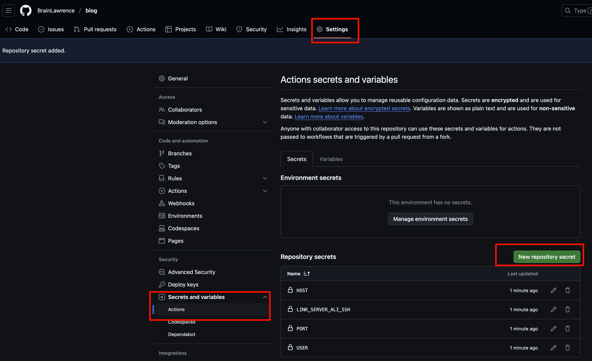

# 🍀 VitePress 使用手册

> [!TIP]
> 本文主要介绍利用 VitePress 搭建个人博客（文档格式为 markdown），然后配置 GitHub Action 实现自动部署到个人服务器。

## 先决条件

1. 拥有能够访问 GitHub 的网络环境；
2. 已安装 Git（官网地址： https://git-scm.com/ ）
3. 已安装 Node.js （18及以上版本，官网地址： https://nodejs.org/ ），建议使用 nvm 管理 node 版本；
4. IDE 编辑器（本文使用 VSCode 示范）；

## 本地搭建与调试

使用 `git clone` 从远端拉取仓库或者使用 `git init` 初始化一个本地仓库；

进入仓库内（目录内含有 `.git` 文件，之后该目录统称为根目录），使用如下命令安装 vitepress 包：

```zsh
npm add -D vitepress
```

安装成功后可以看到根目录下生成了文件夹：`node_modules`；

使用如下命令构建我们的博客项目：

```zsh
npx vitepress init
```

之后按照指引回答问题（第一个问题建议设置为当前目录，即根目录）：

```zsh
┌  Welcome to VitePress!
│
◇  Where should VitePress initialize the config?
│  ./
│
◇  Site title:
│  Brain's Blog
│
◇  Site description:
│  A VitePress Site
│
◇  Theme:
│  Default Theme
│
◇  Use TypeScript for config and theme files?
│  Yes
│
◇  Add VitePress npm scripts to package.json?
│  Yes
│
└  Done! Now run npm run docs:dev and start writing.
```

完成指引后可以看到根目录下生成了文件夹：`.vitepress`；

之后我们在根目录创建 `.gitignore` 文件并填入以下内容：

```txt
.vitepress/dist
.vitepress/cache
node_modules
```

接下来我们看下效果，打开 `pacage.json` 文件，点击如下选项：


或者使用命令行启动：

```zsh
npm run docs:dev
```

启动成功后可以看到控制台打印如下内容：

```zsh
  vitepress v1.6.3

  ➜  Local:   http://localhost:5173/
  ➜  Network: use --host to expose
  ➜  press h to show help
```

我们访问这个地址：`http://localhost:5173/`，出现如下页面表示项目本地搭建成功 ✅


## 创建自动部署流程

> [!tip]
> 这一部份介绍部署到个人的私有服务器，如果是部署到 GitHub Page 请参照官方文档；
> 另外还有两点：
> 1. 确保服务器安装了 Nginx，并了解其使用方法；
> 2. 服务器开启了 SSH 登陆方式；

我们首先将代码提交到 GitHub，然后在页面上选择如下选项：



添加如下密钥（密钥名不重要，但是要对应后面 yml 文件里的变量名）：

```txt
LINK_SERVER_ALI_SSH

HOST

PORT

USER
```

接着我们进入这个页面创建 Action：


将这串代码填入其中：

```yml
# 构建 VitePress 站点并通过SSH将其部署到阿里云服务器的工作流程
#
name: Deploy VitePress site to My Server

on:
  # 在针对 `main` 分支的推送上运行。如果你
  # 使用 `master` 分支作为默认分支，请将其更改为 `master`
  push:
    branches: [main]

  # 允许你从 Actions 选项卡手动运行此工作流程
  workflow_dispatch:

# 设置 GITHUB_TOKEN 的权限，以允许部署到 GitHub Pages
# permissions:
#   contents: read
#   pages: write
#   id-token: write

# 只允许同时进行一次部署，跳过正在运行和最新队列之间的运行队列
# 但是，不要取消正在进行的运行，因为我们希望允许这些生产部署完成
concurrency:
  group: pages
  cancel-in-progress: false

jobs:
  # 构建工作
  build:
    runs-on: ubuntu-latest
    steps:
      - name: Checkout
        uses: actions/checkout@v4
        with:
          fetch-depth: 0 # 如果未启用 lastUpdated，则不需要
      # - uses: pnpm/action-setup@v3 # 如果使用 pnpm，请取消此区域注释
      #   with:
      #     version: 9
      # - uses: oven-sh/setup-bun@v1 # 如果使用 Bun，请取消注释
      - name: Setup Node
        uses: actions/setup-node@v4
        with:
          node-version: 18.20.7
      #     cache: npm # 或 pnpm / yarn
      # - name: Setup Pages
      #   uses: actions/configure-pages@v4
      - name: Install dependencies
        run: npm ci # 或 pnpm install / yarn install / bun install
      - name: Build with VitePress
        run: npm run docs:build # 或 pnpm docs:build / yarn docs:build / bun run docs:build
      - name: Deploy to Server
        uses: easingthemes/ssh-deploy@main
        with:
          # 本地.ssh文件下的私钥id_rsa，存在secrets的PRIVATE_KEY中
          SSH_PRIVATE_KEY: ${{ secrets.LINK_SERVER_ALI_SSH }}
          # 复制操作的参数。"-avzr --delete"意味部署时清空服务器目标目录下的文件
          ARGS: "-avz --delete"
          # 源目录
          SOURCE: ".vitepress/dist/"
          # 部署目标主机
          REMOTE_HOST: ${{ secrets.HOST }}
          # 部署目标主机端口
          REMOTE_PORT: ${{ secrets.PORT }}
          # 登录用户
          REMOTE_USER: ${{ secrets.USER }}
          # 部署目标目录
          TARGET: "./temp/dist/"
          SCRIPT_AFTER: "sudo rsync -av --remove-source-files temp/dist/ nginx/html/vite-press/ && sudo nginx -s reload"
          

  # 部署工作
  # deploy:
  #   environment:
  #     name: github-pages
  #     url: ${{ steps.deployment.outputs.page_url }}
  #   needs: build
  #   runs-on: ubuntu-latest
  #   name: Deploy
  #   steps:
  #     - name: Deploy to GitHub Pages
  #       id: deployment
  #       uses: actions/deploy-pages@v4

```

需要确保 node 版本与本地一致（我这里是18.20.7），另外请手动在服务器创建好相关目录;

保存文件并提交后会自行出发 Action，如果配置没问题的话就会在 `~/nginx/html/vite-press/` 目录下得到构建好的文件，最后在 Nginx 配置好静态资源访问路径就ok了 🌈


## 维护技巧

### 设置源目录

> [!note]
> 源目录指的是存放所有 markdown 文档的目录，默认源目录等同于根目录，把所有 markdown 文件都放在根目录显然不利于后续维护与管理，我们可以设置源目录来统一存放文档数据。

打开 `.vitepress` 目录下的 `config.[ext]` 文件，配置 `srcDir` 以修改源目录，这里我选择 `src`；

```ts
import { defineConfig } from 'vitepress'
export default defineConfig{
  srcDir: './src'
}
```

接着在根目录创建 `src` 文件夹，并将所有 markdown 文件转移到 `src` 文件夹里面；

接着输入 `npm run docs:dev` 启动项目，会发现页面一切正常，说明源目录配置成功 ✅

### 配置 VSCode 粘贴文件位置

> [!note]
> 默认情况下我们将别处复制过来的图片粘贴到 markdown 文档时，图片文件会默认下载到当前文档所在目录之下，这样会影响项目的文档结构，干扰我们查阅文档；
> 可以通过配置 VSCode 来指定粘贴文件的存放位置。

打开 VSCode 的设置：


搜索 `markdown`，选择 `工作区` 找到如下配置：


点击添加项，项内输入：`**/*.md`，值内输入：`${documentWorkspaceFolder}/src/assets/${documentBaseName}/${unixTime}.${fileExtName}`；

我这里的配置是指将粘贴的文件存放到当前工作区的 `src/assets/[markdown文件名]/` 这个文件夹下，如果你想将文件存放到其他目录，可以参照上面的提示自行配置；

> [!CAUTION]
> 目录一定要选择创建在源目录下，否则无法解析。

配置完成后，复制粘贴到 markdown 的文件就会自动保存到我们配置的指定目录下了，至此你就收获到了一个干净整洁的 markdown 文件夹 📁；

Congratulation 🎉 

### 文档移动时自动更新内部链接

> [!note]
> 当我们想将文档归档于一个目录时，我们会发现如果移动了文档位置，文档内的图片就全部失效了，这是因为文档内的图片地址是用相对路径保存的，而 VSCode 又没有默认更新这个路径。

打开 VSCode 的设置：


搜索 `markdown`，选择 `工作区` 找到如下配置：


把默认的 `never` 改成 `always`；

这样我们每次移动文档时，就不用担心内部链接失效了。

Awesome 🥳

## 参考

1. 【官方文档】：https://vitepress.dev/
2. 【官方中文文档】：https://vitepress.dev/zh/
3. 【官方 GitHub】：https://github.com/vuejs/vitepress