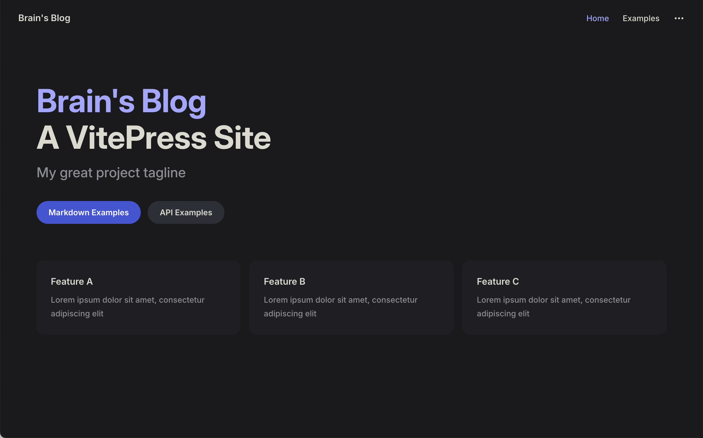

# 🍀 VitePress 使用手册

> [!TIP]
> 本文主要介绍利用 VitePress 搭建个人博客（文档格式为 markdown），然后配置 GitHub Action 实现自动部署到个人服务器。

## 先决条件

1. 拥有能够访问 GitHub 的网络环境；
2. 已安装 Git（官网地址： https://git-scm.com/ ）
3. 已安装 Node.js （18及以上版本，官网地址： https://nodejs.org/ ），建议使用 nvm 管理 node 版本；
4. IDE 编辑器（本文使用 VSCode 示范）；

## 本地搭建与调试

使用 `git clone` 从远端拉取仓库或者使用 `git init` 初始化一个本地仓库；

进入仓库内（目录内含有 `.git` 文件，之后该目录统称为根目录），使用如下命令安装 vitepress 包：

```zsh
npm add -D vitepress
```

安装成功后可以看到根目录下生成了文件夹：`node_modules`；

使用如下命令构建我们的博客项目：

```zsh
npx vitepress init
```

之后按照指引回答问题（第一个问题建议设置为当前目录，即根目录）：

```zsh
┌  Welcome to VitePress!
│
◇  Where should VitePress initialize the config?
│  ./
│
◇  Site title:
│  Brain's Blog
│
◇  Site description:
│  A VitePress Site
│
◇  Theme:
│  Default Theme
│
◇  Use TypeScript for config and theme files?
│  Yes
│
◇  Add VitePress npm scripts to package.json?
│  Yes
│
└  Done! Now run npm run docs:dev and start writing.
```

完成指引后可以看到根目录下生成了文件夹：`.vitepress`；

之后我们在根目录创建 `.gitignore` 文件并填入以下内容：

```txt
.vitepress/dist
.vitepress/cache
node_modules
package-lock.json
```

接下来我们看下效果，打开 `pacage.json` 文件，点击如下选项：


或者使用命令行启动：

```zsh
npm run docs:dev
```

启动成功后可以看到控制台打印如下内容：

```zsh
  vitepress v1.6.3

  ➜  Local:   http://localhost:5173/
  ➜  Network: use --host to expose
  ➜  press h to show help
```

我们访问这个地址：`http://localhost:5173/`，出现如下页面表示项目本地搭建成功 ✅



## 维护技巧

### 设置源目录

> [!note]
> 源目录指的是存放所有 markdown 文档的目录，默认源目录等同于根目录，把所有 markdown 文件都放在根目录显然不利于后续维护与管理，我们可以设置源目录来统一存放文档数据。

打开 `.vitepress` 目录下的 `config.[ext]` 文件，配置 `srcDir` 以修改源目录，这里我选择 `src`；

```ts
import { defineConfig } from 'vitepress'
export default defineConfig{
  srcDir: './src'
}
```

接着在根目录创建 `src` 文件夹，并将所有 markdown 文件转移到 `src` 文件夹里面；

接着输入 `npm run docs:dev` 启动项目，会发现页面一切正常，说明源目录配置成功 ✅

### 配置 VSCode 粘贴文件位置

> [!note]
> 默认情况下我们将别处复制过来的图片粘贴到 markdown 文档时，图片文件会默认下载到当前文档所在目录之下，这样会影响项目的文档结构，干扰我们查阅文档；
> 可以通过配置 VSCode 来指定粘贴文件的存放位置。

打开 VSCode 的设置：


搜索 `markdown`，选择 `工作区` 找到如下配置：


点击添加项，项内输入：`**/*.md`，值内输入：`${documentWorkspaceFolder}/src/assets/${documentBaseName}/${unixTime}.${fileExtName}`；

我这里的配置是指将粘贴的文件存放到当前工作区的 `src/assets/[markdown文件名]/` 这个文件夹下，如果你想将文件存放到其他目录，可以参照上面的提示自行配置；

> [!CAUTION]
> 目录一定要选择创建在源目录下，否则无法解析。

配置完成后，复制粘贴到 markdown 的文件就会自动保存到我们配置的指定目录下了，至此你就收获到了一个干净整洁的 markdown 文件夹 📁；

Congratulation 🎉 

### 文档移动时自动更新内部链接

> [!note]
> 当我们想将文档归档于一个目录时，我们会发现如果移动了文档位置，文档内的图片就全部失效了，这是因为文档内的图片地址是用相对路径保存的，而 VSCode 又没有默认更新这个路径。

打开 VSCode 的设置：


搜索 `markdown`，选择 `工作区` 找到如下配置：


把默认的 `never` 改成 `always`；

这样我们每次移动文档时，就不用担心内部链接失效了。

Awesome 🥳

## 参考

1. 【官方文档】：https://vitepress.dev/
2. 【官方中文文档】：https://vitepress.dev/zh/
3. 【官方 GitHub】：https://github.com/vuejs/vitepress